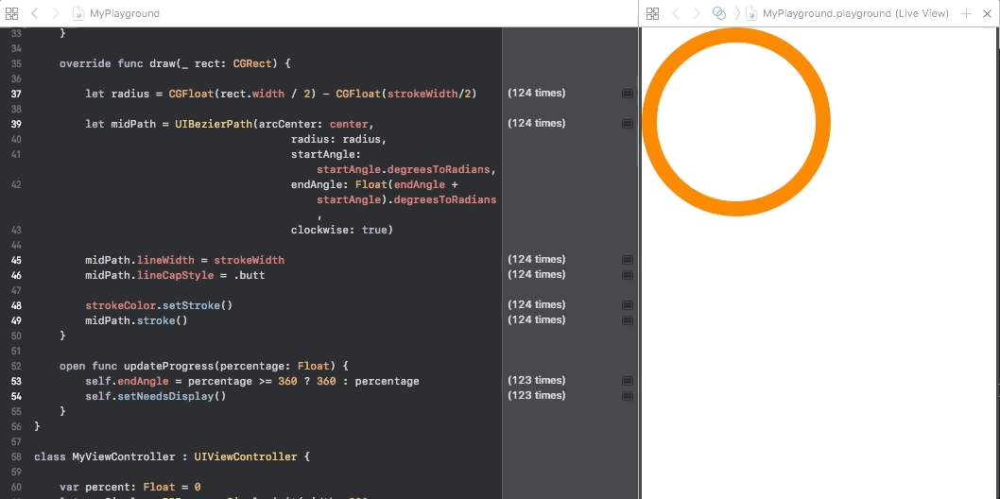

# Progress-Circle
Simple progress bar in the shape of a circle



## Installation

Add the class RDProgressCircle to your project to start using it.

## Usage

Initiate ProgressCircle
```swift
    // init(width: CGFloat, strokeWidth: CGFloat, strokeColor: UIColor, startAngle: Float)
    let proCircle = RDProgressCircle.init(width: 200,
                               strokeWidth: 16,
                               strokeColor: .orange,
                               startAngle: -90)
```
Parameters required:

- width width and heights creat the circle frame with x and y as zero
- strokeWidth: progress bar's size
- strokeColor: progress bar's color
- startAngle: the point in the circumference to start

To update the percentage of the progress use the func updateProgress(percentage: Float) {

```swift
    func bgProcessDidUpdatePackageDownload(package: MyPackage, percent: CGFloat) {
        percent = percent >= 360 ? 0 : percent
        self.proCircle.updateProgress(percentage: percent)
    }
```
 
 The Project comes with a Playground to help the sample
 
 ## Licence
 
 This project is released under the MIT license. See LICENSE for details.
